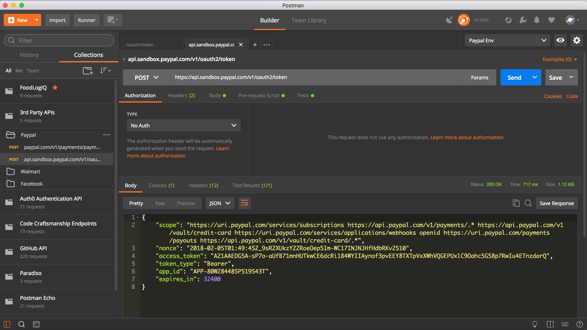
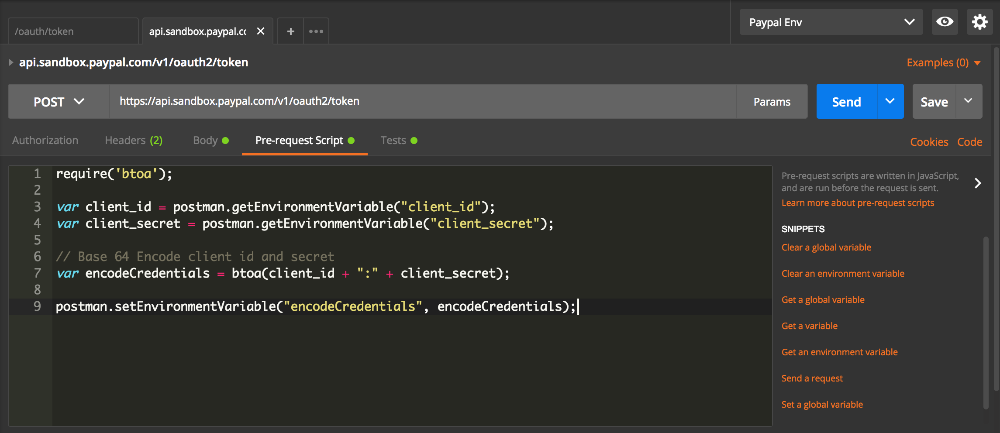

API Workshop - API Testing Tools
## Sections:

* [Bread Crumb Navigation](#bread-crumb-navigation)

## Restful API Testing

API testing is a necessary task to do while building APIs.

Instead of using a browser or typing into a UI and clicking buttons, you can test APIs using tools such as [Curl](https://curl.haxx.se/) and [Postman](https://www.getpostman.com/).

Using a Rest Client you can make Rest calls such as for [HTTP Verbs](https://en.wikipedia.org/wiki/Hypertext_Transfer_Protocol#Request_methods) such as:

* [GET](https://en.wikipedia.org/wiki/Hypertext_Transfer_Protocol#Request_methods)
* [POST](https://en.wikipedia.org/wiki/Hypertext_Transfer_Protocol#Request_methods)
* [PUT](https://en.wikipedia.org/wiki/Hypertext_Transfer_Protocol#Request_methods)
* [DELETE](https://en.wikipedia.org/wiki/Hypertext_Transfer_Protocol#Request_methods)
* [PATCH](https://en.wikipedia.org/wiki/Hypertext_Transfer_Protocol#Request_methods)

When we test an API, we deal with [JSON](https://en.wikipedia.org/wiki/JSON), [XML](https://en.wikipedia.org/wiki/XML), and [Web Services](https://en.wikipedia.org/wiki/Web_service).

## 3rd Party APIs

Here is a list of 3rd Party APIs:

* [Google APIs](https://developers.google.com/apis-explorer/)
* [Yahoo APIs](https://developer.yahoo.com/everything.html)
* [Facebook APIs](https://developers.facebook.com/)
* [Stripe APIs](https://stripe.com/docs/api)
* [Amazon APIs](https://developer.amazon.com/services-and-apis)
* [Walmart APIs](https://developer.walmart.com/#/home)
* [Github APIs](https://developer.github.com/v3/)

Go to [Programmable Web](https://www.programmableweb.com/) to get a complete list of 3rd Party APIs you can utilize

## Testing Restful APIs

You can utilize many different types of tools to test APIs such as:

* [Curl](https://curl.haxx.se/)
* [Postman](https://www.getpostman.com/)
* [HTTPie](https://httpie.org/)
* [Insomnia](https://insomnia.rest/)
* [Telnet](https://en.wikipedia.org/wiki/Telnet)

There are other Rest Clients you can use I just listed a few here

## Postman Rest Client Advantages

I tend to favor Rest Clients like Postman because it helps to automate testing Restful APIs if you utilize some of its advanced features



Notice here that you can create collection folders that can categorize APIs.

You can do much more than this however


Notice here that `Basic {{encodeCredentials}}` has curly braces around `encodeCredentials`

In Postman you surround variables in double curly braces



If you want to set variables before the HTTP call goes out than using [Pre-request Script](https://www.getpostman.com/docs/postman/scripts/pre_request_scripts) is what you want

* Pre-request scripts are snippets of code associated with a collection request that are executed before the request is sent.

* This is perfect for use-cases like including the timestamp in the request headers or sending a random alphanumeric string in the URL parameters.

* Pre-request scripts are written in JavaScript, and the syntax is exactly like that of test scripts except that the response object is not present.

Notice here that I am using *common js* syntax in Postman and in particular `require('btoa'`)` which is using **Postman Sandbox API**

You can find a more complete list in the [Postman Sandbox API reference](https://www.getpostman.com/docs/postman/scripts/postman_sandbox_api_reference)

You can also read [Postman Sandbox](https://www.getpostman.com/docs/postman/scripts/postman_sandbox) for other libraries available in Postman Rest Client


Notice here that the Test script section is similar to Pre-Request Script

With Postman you can write and run tests for each request using the JavaScript language.

But more than that you can set variables in the Test script section that you can save for later use

Notice here the use of `postman.setEnvironmentVariable("access_token", token_type + " " + access_token);` to set **access_token**

This is really useful because we can save the **access_token** for other Rest calls

Instead of manually setting the access token in a variable each day since access tokens tend to expire quickly you can use the tests script section to do that in an automated way.

Notice that we also wrote a test in the test script section as well

```js
// Parse JSON response
var responseBody = JSON.parse(responseBody);

var access_token = responseBody.access_token;
var token_type = responseBody.token_type;

postman.setEnvironmentVariable("access_token", token_type + " " + access_token);

pm.test("Token Type is Bearer", function () {
    var jsonData = pm.response.json();
    pm.expect(jsonData.token_type).to.eql("Bearer");
});
```


Notice here we get a passing test since we got an access token from the Paypal API


Notice here that we set the environment for Paypal here

Here we can use global variables that can be used per environment


Here I greyed out the environment variables for security reasons but you can read more about [Global Variables at Postman Docs](https://www.getpostman.com/docs/postman/environments_and_globals/manage_globals)


Another useful feature in Postman is the Presets for Headers which you can read in the [Docs](https://www.getpostman.com/docs/postman/sending_api_requests/requests)

Header Presets are useful if you find yourself reusing a lot of HTTP Header values often and you can simply set a preset to autofill the HTTP headers for you in one click.


Notice here that we can use the group edit feature to quickly set header values in key value pairs in the group edit view.

You can easily go back to the normal view by clicking `Key-Value Edit` button again.


Postman supports all of the HTTP Verbs in their dropdown menu


You can easily set query string parameters utilizing the params section in postman


Notice here that we can utilize developer tools in Postman.

This is useful when you want to debug the *Pre-request Script* and *Test script* sections in Postman

You can easily set `console.log` statements to debug things.


Notice here that we can run all of the collections utilizing the collection runner.

You can read more about the [Postman Collection Runner Here](https://www.getpostman.com/docs/postman/collection_runs/starting_a_collection_run)

You can import Postman collections easily and if you have Postman Pro account you can share collections with team members.

I covered a good amount of features that Postman offers but read the Fine docs in Postman for more information.

#### Using Curl as a Rest Client

Curl is also a powerful tool to test apis

Here is a sample `GET` request using curl:

```curl
curl -X GET \
  'http://{{URL}}/search?query=chromebook&format=json&apiKey={{API_key}}' \
  -H 'Cache-Control: no-cache' \
  -H 'Content-Type: application/xml'
```

Notice here that we specified the HTTP verb using the flag `-X` we then gave a url and we specified HTTP Headers using `-H`

Here is a sample `POST` request using curl:

```curl
curl -X POST \
  https://api.sandbox.paypal.com/v1/payments/payment \
  -H 'Authorization: afaketoken1234567' \
  -H 'Cache-Control: no-cache' \
  -H 'Content-Type: application/json' \
  -d '{
  "intent": "sale",
  "payer": {
  "payment_method": "paypal"
  },
  "transactions": [
  {
    "amount": {
    "total": "30.11",
    "currency": "USD",
    "details": {
      "subtotal": "30.00",
      "tax": "0.07",
      "shipping": "0.03",
      "handling_fee": "1.00",
      "shipping_discount": "-1.00",
      "insurance": "0.01"
    }
    },
    "description": "The payment transaction description.",
    "custom": "EBAY_EMS_90048630024435",
    "invoice_number": "48787589673",
    "payment_options": {
    "allowed_payment_method": "INSTANT_FUNDING_SOURCE"
    },
    "soft_descriptor": "ECHI5786786",
    "item_list": {
    "items": [
      {
      "name": "hat",
      "description": "Brown hat.",
      "quantity": "5",
      "price": "3",
      "tax": "0.01",
      "sku": "1",
      "currency": "USD"
      },
      {
      "name": "handbag",
      "description": "Black handbag.",
      "quantity": "1",
      "price": "15",
      "tax": "0.02",
      "sku": "product34",
      "currency": "USD"
      }
    ],
    "shipping_address": {
      "recipient_name": "Brian Robinson",
      "line1": "4th Floor",
      "line2": "Unit #34",
      "city": "San Jose",
      "country_code": "US",
      "postal_code": "95131",
      "phone": "011862212345678",
      "state": "CA"
    }
    }
  }
  ],
  "note_to_payer": "Contact us for any questions on your order.",
  "redirect_urls": {
  "return_url": "https://www.example.com/return",
  "cancel_url": "https://www.example.com/cancel"
  }
}'
```

Notice in the POST request we used `-d` flag to pass in a body to the request.

#### Using HTTPie as a rest client

Here is an example `POST` request using [HTTPie Rest Client](https://httpie.org/)

```curl
http --form POST https://api.sandbox.paypal.com/v1/oauth2/token \
'Authorization: Basic aFakeToken' \
'Content-Type: application/x-www-form-urlencoded' \
grant_type='client_credentials'
```

#### Using jq library for nice json output

Here is an example using [jq library](https://stedolan.github.io/jq/)

```curl
curl -X POST \
  https://api.sandbox.paypal.com/v1/oauth2/token \
  -H 'Authorization: Basic afakeToken12345' \
  -H 'Content-Type: application/x-www-form-urlencoded' \
  -d grant_type=client_credentials | jq
```

This gives a nicely formatted json response with indents and all like this:

```json
{
  "scope": "https://uri.paypal.com/services/subscriptions https://api.paypal.com/v1/payments/.* https://api.paypal.com/v1/vault/credit-card https://uri.paypal.com/services/applications/webhooks openid https://uri.paypal.com/payments/payouts https://api.paypal.com/v1/vault/credit-card/.*",
  "nonce": "2018-03-10T00:26:19Zs84muY6oGt55amkV4Yx7AdyPx5FBGYfTW-Z4FfXXECg",
  "access_token": "A21AAGxDJPIqTppEqR_L_LbL3NOXrMPgLVH2pLG3f1U5s9WUJYiHkfLfbC0kC-fk_WbICqRIOmdRBtdEE-wr10VNNavtKzR-Q",
  "token_type": "Bearer",
  "app_id": "APP-80W284485P519543T",
  "expires_in": 32398
}
```

#### Bread Crumb Navigation
_________________________

Previous | Next
:------- | ---:
← [Types of API Testing](./types-of-api-testing.md) | [API Security](./api-security.md) →
