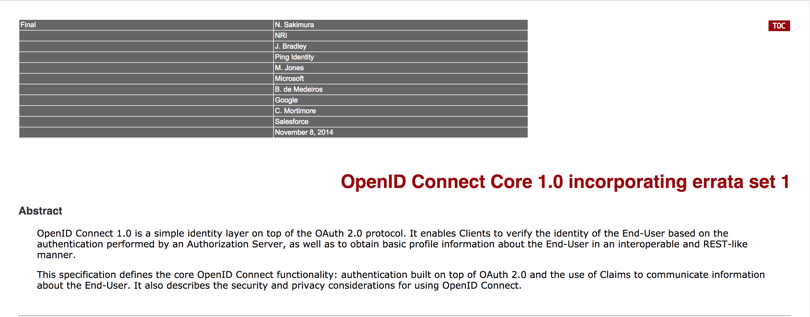
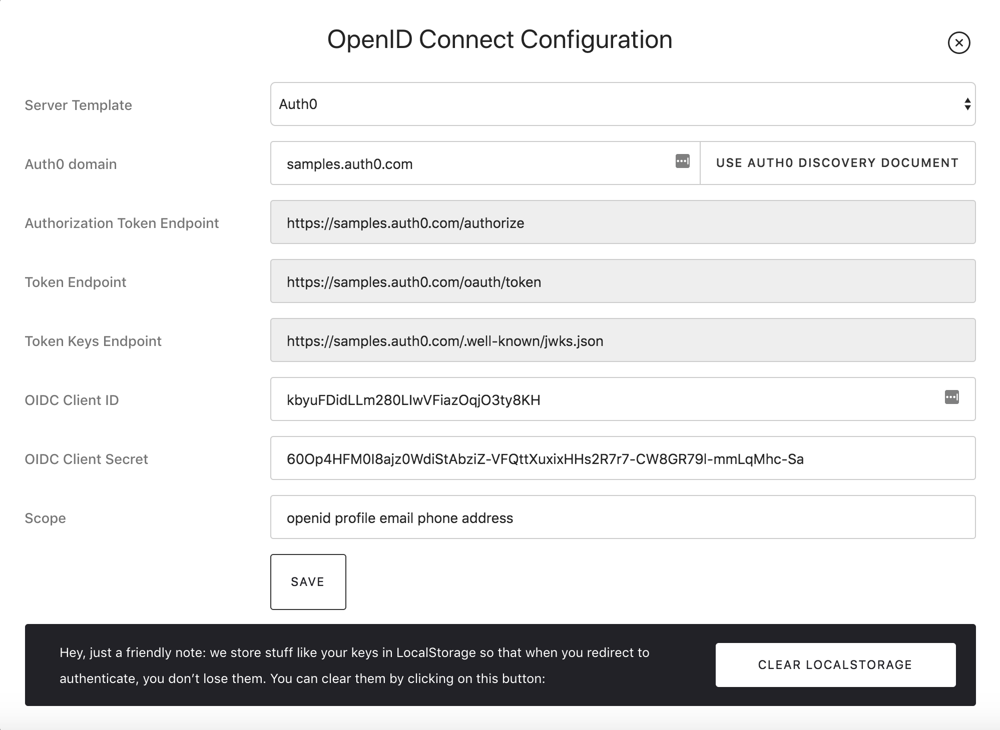
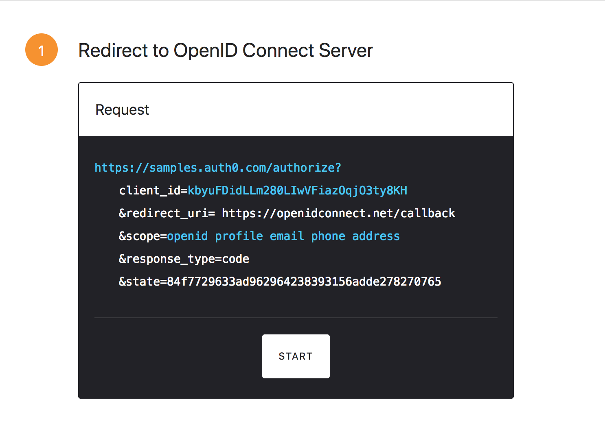
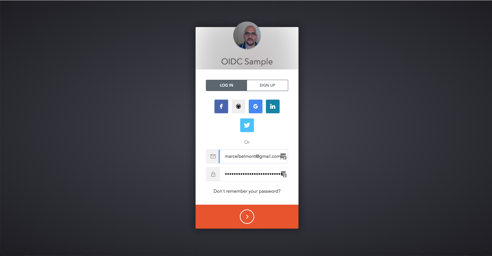
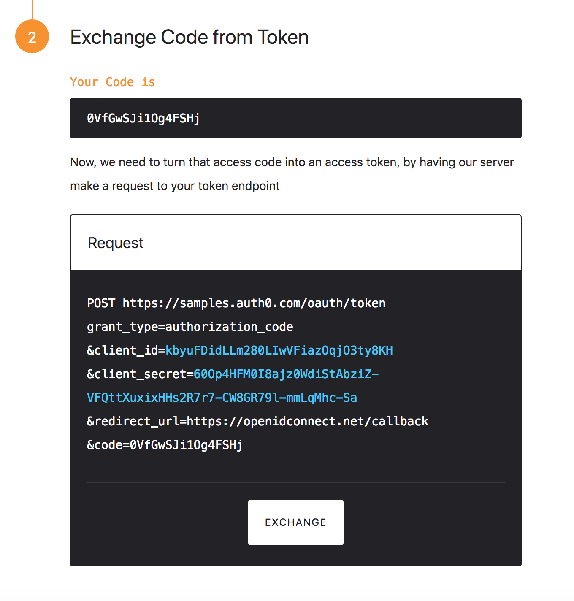
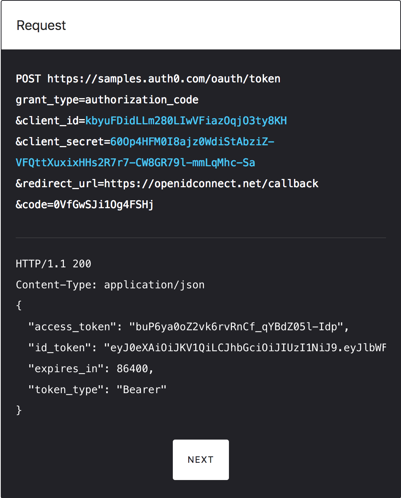
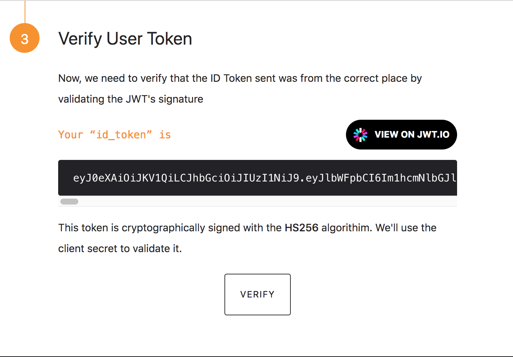
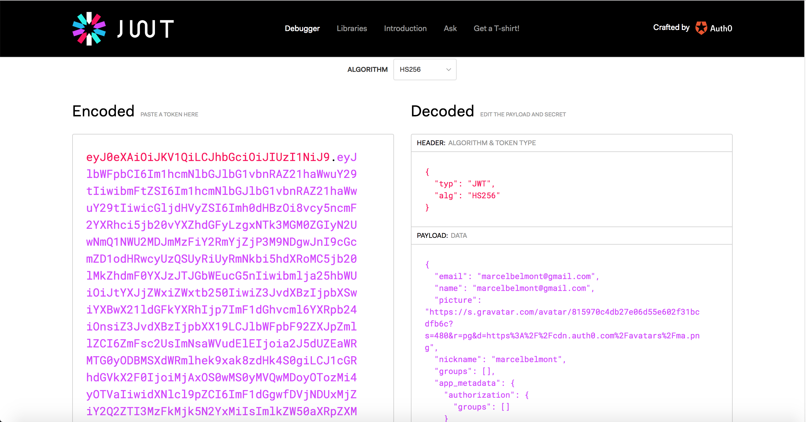
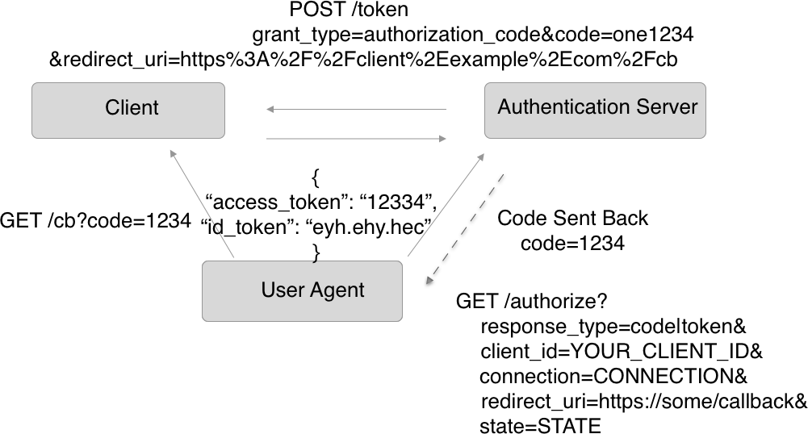

API Workshop - Open ID Connect

## Sections:

* [What is OpenID Connect](#what-is-openid-connect)
* [Difference between OpenID Connect and OpenID](#difference-between-openid-connect-and-openid)
* [Description of How OpenID Connect Protocol Works](#description-of-how-openid-connect-protocol-works)
* [OpenID Connect Specification](#openid-connect-specification)
* [OpenID Connect Playground](#openid-connect-playground)
* [Authorization Code Review Diagram](#authorization-code-review-diagram)
* [Bread Crumb Navigation](#bread-crumb-navigation)

#### What is OpenID Connect

OpenID Connect 1.0 is a simple identity layer on top of the OAuth 2.0 protocol. It allows Clients to verify the identity of the End-User based on the authentication performed by an Authorization Server, as well as to obtain basic profile information about the End-User in an interoperable and REST-like manner.

OpenID Connect allows clients of all types, including Web-based, mobile, and JavaScript clients to request and receive information about authenticated sessions and end-users. The specification suite is extensible, allowing participants to use optional features such as encryption of identity data, discovery of OpenID Providers, and session management, when it makes sense for them.

See http://openid.net/connect/faq/ for a set of answers to Frequently Asked Questions about OpenID Connect.

#### Difference between OpenID Connect and OpenID

OpenID Connect is officially supported standard while OpenID 2.0 has been deprecated.

[Security Stack Exchange Post](https://security.stackexchange.com/questions/44797/when-do-you-use-openid-vs-openid-connect)

> OpenID 2.0 and OpenID Connect are very different standards with completely different parameters and response body formats. Both are built on top of OAuth 2.0 by putting additional values into otherwise valid OAuth 2.0 requests and responses, in order to provide identity information needed for authentication (whereas OAuth 2.0 only provides authorization, not authentication). OpenID Connect improved naming and structure of OpenID 2.0 fields and parameters in order to be easier to use.

#### Description of How OpenID Connect Protocol Works

Let's use the example we mentioned earlier, signing into Auth0 using your Google account, for a high level overview on how the flow works:

When you choose to sign in with your twitter account for linkedin let us say, twitter will send an authorization request to LinkedIn.

LinkedIn will then authenticate your credentials or ask you to login if you are not already signed in and then ask for your authorization and will ask for example to read your email address and ask if you are okay with this action.

Once you have athenticated and authorized to sign in then LinkedIn will send an access token and if requested an ID Token and send this back to twitter.

Twitter can then retrieve user information from the ID Token or use the Access Token to invoke a LinkedIn API.

#### OpenID Connect Specification

Here is the official [OpenID Connect Specification](https://openid.net/specs/openid-connect-core-1_0.html)



#### OpenID Connect Playground

Auth0 built a nice tool to learn more about how OpenID Connect works which you can look at [Here](https://openidconnect.net/)


You can configure the debugger by clicking this cog:


Here is what the configuration looks like:



You just need to click the start button:



You will then be redirected back to login into auth0 account:



Once you enter the proper credentials you will be redirected back debugger and provided an Authorization Code:



You will then exchange this **code** for a token:



You can then click next to verify the `id_token` which is a json web token *jwt*:



You can look at the parts of the jwt by using the [jwt debugger](https://jwt.io/):



Here is the base 64 decoded json web token information:

```json
{
 "email": "-", // omit personal info
 "name": "-", // omit personal info
 "picture": "-", // omit personal info
 "nickname": "-", // omit personal info
 "groups": [],
 "app_metadata": {
  "authorization": {
   "groups": []
  }
 },
 "email_verified": false,
 "clientID": "-", // omit
 "updated_at": "2019-01-21T00:29:32.295Z",
 "user_id": "-", // omit
 "identities": [
  {
   "user_id": "-", // omit personal info
   "provider": "auth0",
   "connection": "Username-Password-Authentication",
   "isSocial": false
  }
 ],
 "created_at": "2019-01-21T00:29:31.834Z",
 "authorization": {
  "groups": []
 },
 "iss": "https://samples.auth0.com/",
 "sub": "auth0|5c45126bcd6e2731d2997f12",
 "aud": "kbyuFDidLLm280LIwVFiazOqjO3ty8KH",
 "iat": 1548030699,
 "exp": 1548066699
}
```

#### Authorization Code Review Diagram

Here is a diagram illustration the authorization code flow that occurred in the debugger:



#### Bread Crumb Navigation
_________________________

Previous | Next
:------- | ---:
← [Authentication](./authentication.md) | [Authorization](./authorization.md) →
